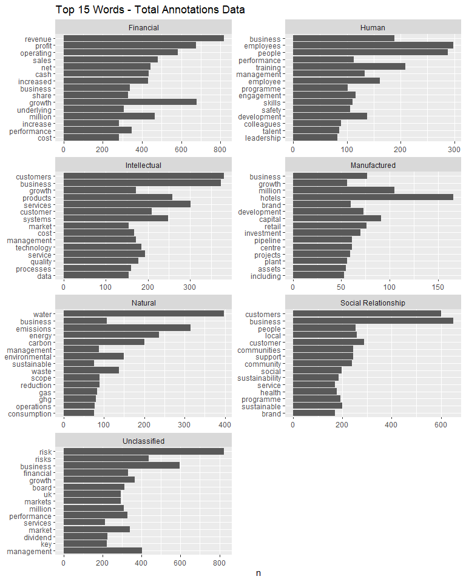
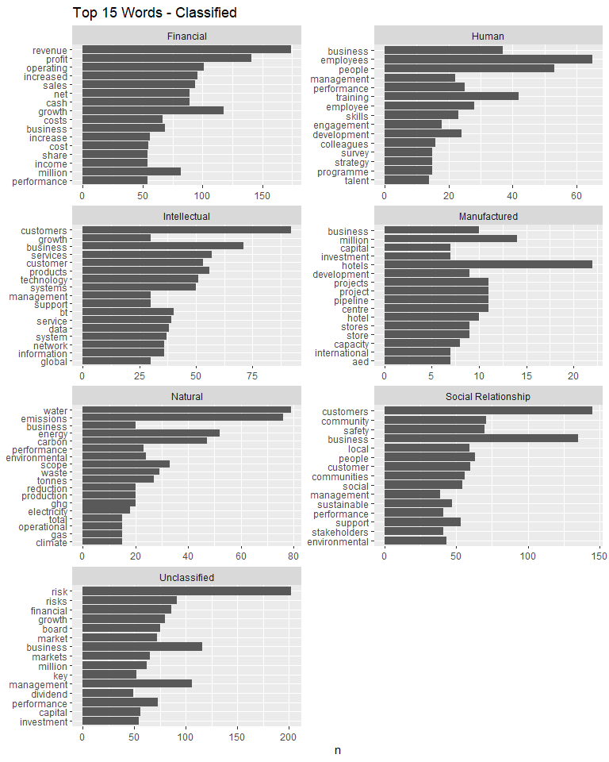

Text Classification Tutorial in R: UK Annual Reports Example
================
Furqan Shah
2024-10-25

# Introduction

In this tutorial, we will learn how to build and implement a text
classification model using a machine learning approach in R,
specifically within the context of UK annual reports. The process covers
data loading, preprocessing, tokenization, visualization, model
training, and evaluation. A manually self-annotated dataset of text from
UK annual reports is used to train, implement, and assess the model’s
performance. This step-by-step guide offers a comprehensive
understanding of text classification, equipping you with techniques that
can be adapted to your own projects.

## Install and Load Libraries

We begin by loading the necessary R libraries for the tasks listed
above.

``` r
# List of required packages
packages <- c("dplyr", "tidyr", "stringr", "tidytext", "tidyverse", "ggplot2", "caret", "tm", "SnowballC")

# Install packages that are not yet installed
installed_packages <- rownames(installed.packages())

for (pkg in packages) {
  if (!(pkg %in% installed_packages)) {
    install.packages(pkg, dependencies = TRUE)
  }
  library(pkg, character.only = TRUE)
}
```

## Load Data

The data consists of 23 separate `.tsv` files, each representing a
different company. Each file contains two columns: `Text` (which holds
sentences or paragraphs) and `Theme` (the category assigned to the
text). The categories in `Theme` column include: **Financial**,
**Human**, **Intellectual**, **Natural**, **Social & Relationship**, and
**Unclassified**, as defined below:

- **Financial**: *Information about the company’s financial performance,
  including revenue, expenses, profits, and financial health.*
- **Human**: *Relates to employees, their well-being, skills, and
  workforce management.*
- **Intellectual**: *Covers intangible assets like patents, trademarks,
  and the company’s innovation capacity.*
- **Natural**: *Focuses on environmental sustainability, resource usage,
  and the company’s ecological impact.*
- **Social & Relationship**: *Refers to the company’s interactions with
  stakeholders, including communities, customers, and regulators.*
- **Manufactured**: *Involves physical assets such as infrastructure,
  equipment, and operational capacity.*
- **Unclassified**: *Includes disclosures that do not fit into the other
  categories.*

The model will be trained on this dataset to classify firm(s) annual
report text into the appropriate reporting themes.

``` r
# Set the path to your data files (Note: Replace the path variable with the path to your own data directory)

path <- "F:/Github Projects/text-classification-ML-approach/data files"

# Create list of files using path
file_list <- list.files(path)
file_list
```

    ##  [1] "2014_angloamerican.tsv"   "2014_baesystems.tsv"     
    ##  [3] "2014_bat.tsv"             "2014_britishland.tsv"    
    ##  [5] "2014_btgroup.tsv"         "2014_cocacola.tsv"       
    ##  [7] "2014_crest.tsv"           "2014_diageo.tsv"         
    ##  [9] "2014_fresnillo.tsv"       "2014_gog.tsv"            
    ## [11] "2014_halfords.tsv"        "2014_hammerson.tsv"      
    ## [13] "2014_howden.tsv"          "2014_hsbc.tsv"           
    ## [15] "2014_ihg.tsv"             "2014_lloyds.tsv"         
    ## [17] "2014_marksnspencer.tsv"   "2014_mediclinic.tsv"     
    ## [19] "2014_mondi.tsv"           "2014_sage.tsv"           
    ## [21] "2014_unilever.tsv"        "2014_unitedutilities.tsv"
    ## [23] "2014_vodafone.tsv"

``` r
# Function to read the files
read_file <- function(file_name) {
  read_tsv(file.path(path, file_name),
           col_names = TRUE,
           col_types = "cc") %>%
    mutate(file_name = file_name)
}

# Apply the function
data <- bind_rows(lapply(file_list, read_file))
data
```

    ## # A tibble: 9,751 × 3
    ##    Text                                                          Theme file_name
    ##    <chr>                                                         <chr> <chr>    
    ##  1 Notably, our production performance in all our key businesse… Uncl… 2014_ang…
    ##  2 otwithstanding the tough pricing environment, there have bee… Uncl… 2014_ang…
    ##  3 SAFETYI never fail to be impressed by the level of commitmen… Human 2014_ang…
    ##  4 Under Tony O’Neill, our technical director, this is being gi… Human 2014_ang…
    ##  5 Allied to this, we are focusing on the deployment of  new te… Inte… 2014_ang…
    ##  6 These macro-economic conditions and the over-supply  of cert… Uncl… 2014_ang…
    ##  7 ResultsThese challenging conditions are demonstrating the re… Fina… 2014_ang…
    ##  8 PerformanceUnder the leadership of Mark Cutifani, considerab… Uncl… 2014_ang…
    ##  9 n 2014, we passed a number of important milestones on  the r… Fina… 2014_ang…
    ## 10 2014 saw a notable divergence in performance between the wor… Uncl… 2014_ang…
    ## # ℹ 9,741 more rows

``` r
# Preview the data structure
glimpse(data)
```

    ## Rows: 9,751
    ## Columns: 3
    ## $ Text      <chr> "Notably, our production performance in all our key business…
    ## $ Theme     <chr> "Unclassified", "Unclassified", "Human", "Human", "Intellect…
    ## $ file_name <chr> "2014_angloamerican.tsv", "2014_angloamerican.tsv", "2014_an…

## Data Preprocessing, Cleaning and Exploration

This section focuses on cleaning and preprocessing the text data to
prepare it for building a classification model. The process involves
removing special characters, stripping unnecessary white spaces, and
filtering out short annotations. Additionally, each document is assigned
a unique ID to ensure easy tracking and reference. After the data is
preprocessed, we will explore the content by visualizing the most
frequent words in each category, providing insights into the themes and
common terms associated with them. These steps help ensure the data is
clean, standardized, and ready for further analysis.

``` r
# Assign an ID to each annotation
annotations <- data %>%
  na.omit() %>%
  rowid_to_column(., "id") %>%
  rename(text = Text,
         theme = Theme)

glimpse(annotations)
```

    ## Rows: 9,711
    ## Columns: 4
    ## $ id        <int> 1, 2, 3, 4, 5, 6, 7, 8, 9, 10, 11, 12, 13, 14, 15, 16, 17, 1…
    ## $ text      <chr> "Notably, our production performance in all our key business…
    ## $ theme     <chr> "Unclassified", "Unclassified", "Human", "Human", "Intellect…
    ## $ file_name <chr> "2014_angloamerican.tsv", "2014_angloamerican.tsv", "2014_an…

``` r
# Remove special characters and strip extra white space
annotations <- annotations %>%
  mutate_at(vars(text), funs(gsub("[?âè.ã'’'½_&$,%'-']", " ", .))) %>%   # removing special characters
  mutate_at(vars(text), funs(gsub("([0-9])([a-z])", "\\1 \\2", .))) %>%  # creating gap between words and numbers
  mutate_at(vars(text), funs(gsub("([a-z])([0-9])", "\\1 \\2", .))) %>%  # same as above with reversed order
  mutate_at(vars(text), funs(gsub("\\s+", " ", .))) %>%                  # stripping extra white space
  mutate(length = lengths(gregexpr("\\W+", text)) + 1,                   # number of words in an annotation
         mean_length = mean(as.numeric(length))) %>%                     # average length of annotations
  filter(length > 1)                                                     # Filter out short annotations

glimpse(annotations)
```

    ## Rows: 9,711
    ## Columns: 6
    ## $ id          <int> 1, 2, 3, 4, 5, 6, 7, 8, 9, 10, 11, 12, 13, 14, 15, 16, 17,…
    ## $ text        <chr> "Notably our production performance in all our key busines…
    ## $ theme       <chr> "Unclassified", "Unclassified", "Human", "Human", "Intelle…
    ## $ file_name   <chr> "2014_angloamerican.tsv", "2014_angloamerican.tsv", "2014_…
    ## $ length      <dbl> 102, 143, 88, 42, 81, 72, 107, 33, 75, 44, 60, 112, 74, 46…
    ## $ mean_length <dbl> 54.62651, 54.62651, 54.62651, 54.62651, 54.62651, 54.62651…

``` r
# Number of annotations per theme
annotations %>% count(theme)
```

    ## # A tibble: 7 × 2
    ##   theme                   n
    ##   <chr>               <int>
    ## 1 Financial            1851
    ## 2 Human                 704
    ## 3 Intellectual         1590
    ## 4 Manufactured          501
    ## 5 Natural               575
    ## 6 Social_Relationship  1929
    ## 7 Unclassified         2561

The code below visualizes the top 15 most frequent words in each
reporting category, helping to identify key terms associated with
different themes. First, the text is tokenized, breaking annotations
into individual words (tokens), per row. Non-word tokens (e.g., numbers,
special characters) and common stop words (like “the,” “and,” “of”) are
filtered out, allowing the focus to remain on meaningful terms that
differentiate each category.

``` r
# Plot top 15 words - total annotations
tidy_top15 <- annotations %>%
  unnest_tokens(word, text) %>%                               # Tokenize text into one word per row
  mutate_all(funs(gsub("([0-9])([a-z])", "\\1 \\2", .))) %>%
  mutate_all(funs(gsub("([a-z])([0-9])", "\\1 \\2", .))) %>%
  unnest_tokens(word, word) %>%
  mutate_all(funs(gsub("[?âè.''_&$,%]"," ", .))) %>%
  unnest_tokens(word, word) %>%
  anti_join(stop_words) %>%
  filter(!str_detect(word, "^[0-9]*$")) %>%
  count(word, theme) %>%
  group_by(theme) %>%
  arrange(desc(n)) %>%
  top_n(15) %>%                                            # Select the top 15 frequent words across six categories.
  ungroup() %>%
  arrange(theme, desc(n))
```

    ## Joining with `by = join_by(word)`
    ## Selecting by n

``` r
tidy_top15
```

    ## # A tibble: 105 × 3
    ##    word        theme         n
    ##    <chr>       <chr>     <int>
    ##  1 revenue     Financial   816
    ##  2 growth      Financial   678
    ##  3 profit      Financial   676
    ##  4 operating   Financial   583
    ##  5 sales       Financial   480
    ##  6 million     Financial   464
    ##  7 net         Financial   444
    ##  8 cash        Financial   434
    ##  9 increased   Financial   431
    ## 10 performance Financial   348
    ## # ℹ 95 more rows

``` r
tidy_top15_plot <- tidy_top15 %>%
  mutate(word = reorder(word, n)) %>%
  ggplot(aes(word, n)) +
  geom_col () +
  labs(x = NULL, y = "n", title = "Top 15 Words - Training") +
  facet_wrap(~theme, ncol = 2, scales = "free") +
  coord_flip()
tidy_top15_plot
```

<!-- -->

## Split Data into Training and Testing Sets

In this section, the annotations data is split into a training set and a
testing set. The training set, comprising 80% of the data selected at
random, will be used to train the model, while the remaining 20% serves
as the testing set for validation. This split ensures the model is
evaluated on unseen data to assess its performance accurately.

``` r
## Split data into training and testing sets
set.seed(123)  # For reproducibility

train_row_numbers <- createDataPartition(annotations$theme, p = 0.8, list = FALSE)

train_data <- annotations[train_row_numbers, ]
test_data <- annotations[-train_row_numbers, ]

glimpse(train_data)
```

    ## Rows: 7,771
    ## Columns: 6
    ## $ id          <int> 2, 4, 5, 6, 7, 8, 9, 10, 11, 12, 13, 14, 16, 17, 18, 19, 2…
    ## $ text        <chr> "otwithstanding the tough pricing environment there have b…
    ## $ theme       <chr> "Unclassified", "Human", "Intellectual", "Unclassified", "…
    ## $ file_name   <chr> "2014_angloamerican.tsv", "2014_angloamerican.tsv", "2014_…
    ## $ length      <dbl> 143, 42, 81, 72, 107, 33, 75, 44, 60, 112, 74, 46, 45, 69,…
    ## $ mean_length <dbl> 54.62651, 54.62651, 54.62651, 54.62651, 54.62651, 54.62651…

``` r
glimpse(test_data)
```

    ## Rows: 1,940
    ## Columns: 6
    ## $ id          <int> 1, 3, 15, 21, 25, 38, 50, 54, 55, 59, 63, 64, 65, 72, 73, …
    ## $ text        <chr> "Notably our production performance in all our key busines…
    ## $ theme       <chr> "Unclassified", "Human", "Human", "Unclassified", "Financi…
    ## $ file_name   <chr> "2014_angloamerican.tsv", "2014_angloamerican.tsv", "2014_…
    ## $ length      <dbl> 102, 88, 68, 26, 5, 45, 110, 67, 81, 100, 67, 43, 124, 87,…
    ## $ mean_length <dbl> 54.62651, 54.62651, 54.62651, 54.62651, 54.62651, 54.62651…

## Tokenizing Training and Testing Data

In this section, the training and testing data are tokenized, converting
each annotation into individual words (one word per row). Stop words are
removed to focus on meaningful terms, and Porter stemming is applied to
reduce words to their root form. For example, “connecting,” “connected,”
and “connection” are all reduced to “connect,” helping to standardize
the text and improve model performance.

``` r
## Prepare training data
tidy_train_data <- train_data %>%
  filter(!str_detect(text, "^[0-9]*$")) %>%
  unnest_tokens(word, text) %>%
  anti_join(stop_words) %>%                    # removing stop words     
  mutate(word = SnowballC::wordStem(word)) %>% # Stem words to their morphological root (Porter's stemming)
  mutate(characters = nchar(word)) %>%         # number of alphabets in a word
  filter(characters > 3) 
```

    ## Joining with `by = join_by(word)`

``` r
glimpse(tidy_train_data)
```

    ## Rows: 196,991
    ## Columns: 7
    ## $ id          <int> 2, 2, 2, 2, 2, 2, 2, 2, 2, 2, 2, 2, 2, 2, 2, 2, 2, 2, 2, 2…
    ## $ theme       <chr> "Unclassified", "Unclassified", "Unclassified", "Unclassif…
    ## $ file_name   <chr> "2014_angloamerican.tsv", "2014_angloamerican.tsv", "2014_…
    ## $ length      <dbl> 143, 143, 143, 143, 143, 143, 143, 143, 143, 143, 143, 143…
    ## $ mean_length <dbl> 54.62651, 54.62651, 54.62651, 54.62651, 54.62651, 54.62651…
    ## $ word        <chr> "otwithstand", "tough", "price", "environ", "encourag", "d…
    ## $ characters  <int> 11, 5, 5, 7, 8, 7, 8, 4, 5, 6, 5, 8, 7, 6, 4, 4, 7, 10, 4,…

``` r
## Prepare test data
tidy_test_data <- test_data %>%
  filter(!str_detect(text, "^[0-9]*$")) %>%
  unnest_tokens(word, text) %>%
  anti_join(stop_words) %>%                    # removing stop words     
  mutate(word = SnowballC::wordStem(word)) %>% # Stem words to their morphological root (Porter's stemming)
  mutate(characters = nchar(word)) %>%         # number of alphabets in a word
  filter(characters > 3)
```

    ## Joining with `by = join_by(word)`

``` r
glimpse(tidy_test_data)
```

    ## Rows: 49,493
    ## Columns: 7
    ## $ id          <int> 1, 1, 1, 1, 1, 1, 1, 1, 1, 1, 1, 1, 1, 1, 1, 1, 1, 1, 1, 1…
    ## $ theme       <chr> "Unclassified", "Unclassified", "Unclassified", "Unclassif…
    ## $ file_name   <chr> "2014_angloamerican.tsv", "2014_angloamerican.tsv", "2014_…
    ## $ length      <dbl> 102, 102, 102, 102, 102, 102, 102, 102, 102, 102, 102, 102…
    ## $ mean_length <dbl> 54.62651, 54.62651, 54.62651, 54.62651, 54.62651, 54.62651…
    ## $ word        <chr> "notabl", "product", "perform", "busi", "ahead", "plan", "…
    ## $ characters  <int> 6, 7, 7, 4, 5, 4, 5, 4, 4, 4, 7, 6, 5, 5, 6, 7, 9, 5, 9, 4…

## Create Document-Term-Matrices for Training and Test Data

In this section, the tokenized training and testing data from the
previous step are used to create a Document-Term Matrix (DTM) for each
dataset. To enhance the DTM, ***TF-IDF*** (Term Frequency-Inverse
Document Frequency) weighting is applied.

***TF-IDF*** relies on the intuition that: (i) the more frequently a
word appears in a document (in this case, a narrative reporting
category), the more representative it is of that document’s content; and
(ii) the more documents a word appears in, the less useful it is for
distinguishing between them. This approach helps capture features
(words) that are unique to specific narrative reporting categories,
improving the model’s ability to classify the content accurately.

The code `removeSparseTerms(sparse = 0.99)` filters out infrequent words
from a DTM. It removes terms that appear in less than 1% of the
documents, helping to eliminate rare, less informative words and reduce
the matrix size, thus improving model efficiency.

``` r
# Create DTM for training data
dtm_train_data <- tidy_train_data %>%
  filter(grepl("^[[:alpha:]]+$", word)) %>%
  count(id, word) %>%
  cast_dtm(document = id,
           term = word,
           value = n,
           weighting = tm::weightTfIdf) %>%
  removeSparseTerms(sparse = 0.99)

dtm_train_data
```

    ## <<DocumentTermMatrix (documents: 7710, terms: 469)>>
    ## Non-/sparse entries: 101857/3514133
    ## Sparsity           : 97%
    ## Maximal term length: 13
    ## Weighting          : term frequency - inverse document frequency (normalized) (tf-idf)

``` r
# Create DTM for test data
dtm_test_data <- tidy_test_data %>%
  filter(grepl("^[[:alpha:]]+$", word)) %>%
  count(id, word) %>%
  cast_dtm(document = id,
           term = word,
           value = n,
           weighting = tm::weightTfIdf) %>%
  removeSparseTerms(sparse = 0.997)

dtm_test_data
```

    ## <<DocumentTermMatrix (documents: 1928, terms: 1235)>>
    ## Non-/sparse entries: 33678/2347402
    ## Sparsity           : 99%
    ## Maximal term length: 14
    ## Weighting          : term frequency - inverse document frequency (normalized) (tf-idf)

## Train the Text Classification Model using Training Data

In this section, we build a text classification model using training
data. We use the `ranger` algorithm, which is a fast implementation of
random forest optimized for high-dimensional data such as text. The
training is conducted using an out-of-bag (OOB) sampling method, where
each tree is trained on a bootstrap sample containing approximately 63%
of the data, while the remaining 37%—the OOB data—serves as a test set
for that tree. By aggregating the OOB predictions across all trees, the
model provides an estimate of prediction error and thus a measure of
model performance. For this tutorial, the model is trained using 20
trees, offering a balance between efficiency and accuracy, though a
higher number could improve performance.

``` r
# Slice training data so that only documents in the DTM remain (some were dropped due to sparsity when creating DTM)
doc_names <- as.numeric(dtm_train_data$dimnames$Docs) # Save doc names

slice_train_data <- train_data %>% 
  filter(id %in% doc_names)

glimpse(slice_train_data)
```

    ## Rows: 7,710
    ## Columns: 6
    ## $ id          <int> 2, 4, 5, 6, 7, 8, 9, 10, 11, 12, 13, 14, 16, 17, 18, 19, 2…
    ## $ text        <chr> "otwithstanding the tough pricing environment there have b…
    ## $ theme       <chr> "Unclassified", "Human", "Intellectual", "Unclassified", "…
    ## $ file_name   <chr> "2014_angloamerican.tsv", "2014_angloamerican.tsv", "2014_…
    ## $ length      <dbl> 143, 42, 81, 72, 107, 33, 75, 44, 60, 112, 74, 46, 45, 69,…
    ## $ mean_length <dbl> 54.62651, 54.62651, 54.62651, 54.62651, 54.62651, 54.62651…

``` r
set.seed(1234)

# Build a model using random forest "ranger" algorithm
ranger_model <- train(x = as.matrix(dtm_train_data),
                    y = factor(slice_train_data$theme),
                    method = "ranger",
                    importance = "impurity",
                    num.trees = 20,
                    trControl = trainControl(method = "oob"))

# View the model
ranger_model
```

    ## Random Forest 
    ## 
    ## 7710 samples
    ##  469 predictor
    ##    7 classes: 'Financial', 'Human', 'Intellectual', 'Manufactured', 'Natural', 'Social_Relationship', 'Unclassified' 
    ## 
    ## No pre-processing
    ## Resampling results across tuning parameters:
    ## 
    ##   mtry  splitrule   Accuracy   Kappa    
    ##     2   gini        0.5112207  0.3817132
    ##     2   extratrees  0.4628356  0.3143800
    ##   235   gini        0.6239948  0.5373403
    ##   235   extratrees  0.6346304  0.5500182
    ##   469   gini        0.6156939  0.5268515
    ##   469   extratrees  0.6237354  0.5365658
    ## 
    ## Tuning parameter 'min.node.size' was held constant at a value of 1
    ## Accuracy was used to select the optimal model using the largest value.
    ## The final values used for the model were mtry = 235, splitrule = extratrees
    ##  and min.node.size = 1.

``` r
# View the confusion matrix from OOB sampling with aggregated predictions across all trees
# Note this is an internally generated measure of model accuracy (i.e., not the confusion matrix from test data)
ranger_model$finalModel$confusion.matrix
```

    ##                      predicted
    ## true                  Financial Human Intellectual Manufactured Natural
    ##   Financial                1171     5           47           18       4
    ##   Human                       8   334           29            1       3
    ##   Intellectual               78    25          683           44      19
    ##   Manufactured               35     3           70          126      17
    ##   Natural                    10     5           25            6     318
    ##   Social_Relationship        49   102          158           19      37
    ##   Unclassified              204    53          203           63      16
    ##                      predicted
    ## true                  Social_Relationship Unclassified <NA>
    ##   Financial                            40          185    0
    ##   Human                               125           60    1
    ##   Intellectual                        187          224    1
    ##   Manufactured                         38          109    0
    ##   Natural                              65           26    0
    ##   Social_Relationship                 947          210    0
    ##   Unclassified                        235         1269    0

## Make Predictions and Evaluate the Model on Test Data

In this section, we use the trained model to make predictions on the
testing data and evaluate its performance. To do this, we generate a
confusion matrix and calculate various performance metrics for each
reporting category, including accuracy, balance, sensitivity, F1 score,
and kappa. These metrics will provide a comprehensive assessment of how
well the model performs across different categories.

``` r
## Implemented the model on the testing data set
predictions_test_data <- predict.train(ranger_model, as.matrix(dtm_test_data))

test_data_slice <- slice(annotations, as.numeric(dtm_test_data$dimnames$Docs)) %>%
  mutate(theme = factor(theme, levels = unique(theme)))

confusion_matrix <- confusionMatrix(reference = test_data_slice$theme, data = predictions_test_data, mode = 'everything')
confusion_matrix
```

    ## Confusion Matrix and Statistics
    ## 
    ##                      Reference
    ## Prediction            Unclassified Human Financial Social_Relationship
    ##   Unclassified                 339    13        57                  47
    ##   Human                          9    89         0                  19
    ##   Financial                     48     0       289                   8
    ##   Social_Relationship           59    30         8                 261
    ##   Intellectual                  47     7        11                  34
    ##   Natural                        7     0         0                  10
    ##   Manufactured                   1     0         5                   2
    ##                      Reference
    ## Prediction            Intellectual Natural Manufactured
    ##   Unclassified                  61       9           31
    ##   Human                          5       0            0
    ##   Financial                     21       1            5
    ##   Social_Relationship           44       9            7
    ##   Intellectual                 168       6           17
    ##   Natural                        6      87            4
    ##   Manufactured                  10       2           35
    ## 
    ## Overall Statistics
    ##                                          
    ##                Accuracy : 0.6577         
    ##                  95% CI : (0.636, 0.6789)
    ##     No Information Rate : 0.2645         
    ##     P-Value [Acc > NIR] : < 2.2e-16      
    ##                                          
    ##                   Kappa : 0.5772         
    ##                                          
    ##  Mcnemar's Test P-Value : NA             
    ## 
    ## Statistics by Class:
    ## 
    ##                      Class: Unclassified Class: Human Class: Financial
    ## Sensitivity                       0.6647      0.64029           0.7811
    ## Specificity                       0.8463      0.98155           0.9467
    ## Pos Pred Value                    0.6086      0.72951           0.7769
    ## Neg Pred Value                    0.8753      0.97231           0.9479
    ## Precision                         0.6086      0.72951           0.7769
    ## Recall                            0.6647      0.64029           0.7811
    ## F1                                0.6354      0.68199           0.7790
    ## Prevalence                        0.2645      0.07210           0.1919
    ## Detection Rate                    0.1758      0.04616           0.1499
    ## Detection Prevalence              0.2889      0.06328           0.1929
    ## Balanced Accuracy                 0.7555      0.81092           0.8639
    ##                      Class: Social_Relationship Class: Intellectual
    ## Sensitivity                              0.6850             0.53333
    ## Specificity                              0.8985             0.92436
    ## Pos Pred Value                           0.6244             0.57931
    ## Neg Pred Value                           0.9205             0.91026
    ## Precision                                0.6244             0.57931
    ## Recall                                   0.6850             0.53333
    ## F1                                       0.6533             0.55537
    ## Prevalence                               0.1976             0.16338
    ## Detection Rate                           0.1354             0.08714
    ## Detection Prevalence                     0.2168             0.15041
    ## Balanced Accuracy                        0.7918             0.72885
    ##                      Class: Natural Class: Manufactured
    ## Sensitivity                 0.76316             0.35354
    ## Specificity                 0.98512             0.98907
    ## Pos Pred Value              0.76316             0.63636
    ## Neg Pred Value              0.98512             0.96583
    ## Precision                   0.76316             0.63636
    ## Recall                      0.76316             0.35354
    ## F1                          0.76316             0.45455
    ## Prevalence                  0.05913             0.05135
    ## Detection Rate              0.04512             0.01815
    ## Detection Prevalence        0.05913             0.02853
    ## Balanced Accuracy           0.87414             0.67130

``` r
prediction_results <- cbind(test_data_slice, predictions_test_data)
glimpse(prediction_results)
```

    ## Rows: 1,928
    ## Columns: 7
    ## $ id                    <int> 1, 3, 15, 21, 25, 38, 50, 54, 55, 59, 63, 64, 65…
    ## $ text                  <chr> "Notably our production performance in all our k…
    ## $ theme                 <fct> Unclassified, Human, Human, Unclassified, Financ…
    ## $ file_name             <chr> "2014_angloamerican.tsv", "2014_angloamerican.ts…
    ## $ length                <dbl> 102, 88, 68, 26, 5, 45, 110, 67, 81, 100, 67, 43…
    ## $ mean_length           <dbl> 54.62651, 54.62651, 54.62651, 54.62651, 54.62651…
    ## $ predictions_test_data <fct> Financial, Social_Relationship, Human, Unclassif…

The confusion matrix generated from the model’s predictions on the test
data shows that the **Financial** and **Natural** reporting categories
have the highest accuracy. This is further supported by performance
metrics such as sensitivity, specificity, and F1 score. On the other
hand, the **Manufactured** category is the least accurately classified.
This is understandable, as companies often describe their assets using
different terminology, reflecting the varied nature of the assets they
rely on for value creation. For instance, a retail firm might refer to
its global network of stores, while a hotel chain may focus on its hotel
properties, leading to differences in terminology that make
classification more challenging.

The next section provides further validation of the model.

## Further Model Validation: Comparing Top Words in Training Data and Model-Classified Data

In this section, we visualize and assess the consistency between the top
15 words in each category from the training dataset and those from the
classifications assigned by the text classification model. Our goal is
to determine whether the top 15 words from the model’s classified data
resemble those from the training set and accurately reflect the expected
themes. By comparing these, we can gauge the model’s effectiveness in
correctly classifying the text.

``` r
# Plot top 15 words - Classified data
predicted_tidy_top15 <- prediction_results %>%
  unnest_tokens(word, text) %>%
  mutate_all(funs(gsub("([0-9])([a-z])", "\\1 \\2", .))) %>%
  mutate_all(funs(gsub("([a-z])([0-9])", "\\1 \\2", .))) %>%
  unnest_tokens(word, word) %>%
  mutate_all(funs(gsub("[?âè.''_&$,%]"," ", .))) %>%
  unnest_tokens(word, word) %>%
  anti_join(stop_words) %>%
  filter(!str_detect(word, "^[0-9]*$")) %>%
  count(word, predictions_test_data) %>%
  group_by(predictions_test_data) %>%
  arrange(desc(n)) %>%
  top_n(15) %>%
  ungroup() %>%
  arrange(predictions_test_data, desc(n))
```

    ## Joining with `by = join_by(word)`
    ## Selecting by n

``` r
predicted_tidy_top15
```

    ## # A tibble: 112 × 3
    ##    word      predictions_test_data     n
    ##    <chr>     <chr>                 <int>
    ##  1 revenue   Financial               174
    ##  2 profit    Financial               141
    ##  3 growth    Financial               118
    ##  4 operating Financial               101
    ##  5 increased Financial                96
    ##  6 sales     Financial                94
    ##  7 cash      Financial                89
    ##  8 net       Financial                89
    ##  9 million   Financial                82
    ## 10 business  Financial                69
    ## # ℹ 102 more rows

``` r
predicted_top15_plot <- 
  predicted_tidy_top15 %>%
  mutate(word = reorder(word, n)) %>%
  ggplot(aes(word, n)) +
  geom_col () +
  labs(x = NULL, y = "n", title = "Top 15 Words - Classified") +
  facet_wrap(~predictions_test_data, ncol = 2, scales = "free") +
  coord_flip()
predicted_top15_plot
```

<!-- -->

``` r
# Plot top 15 words - training data
train_tidy_top15 <- train_data %>%
  unnest_tokens(word, text) %>%
  mutate_all(funs(gsub("([0-9])([a-z])", "\\1 \\2", .))) %>%
  mutate_all(funs(gsub("([a-z])([0-9])", "\\1 \\2", .))) %>%
  unnest_tokens(word, word) %>%
  mutate_all(funs(gsub("[?âè.''_&$,%]"," ", .))) %>%
  unnest_tokens(word, word) %>%
  anti_join(stop_words) %>%
  filter(!str_detect(word, "^[0-9]*$")) %>%
  count(word, theme) %>%
  group_by(theme) %>%
  arrange(desc(n)) %>%
  top_n(15) %>%
  ungroup() %>%
  arrange(theme, desc(n))
```

    ## Joining with `by = join_by(word)`
    ## Selecting by n

``` r
train_tidy_top15
```

    ## # A tibble: 107 × 3
    ##    word        theme         n
    ##    <chr>       <chr>     <int>
    ##  1 revenue     Financial   648
    ##  2 growth      Financial   565
    ##  3 profit      Financial   539
    ##  4 operating   Financial   480
    ##  5 sales       Financial   402
    ##  6 million     Financial   384
    ##  7 net         Financial   365
    ##  8 cash        Financial   356
    ##  9 increased   Financial   339
    ## 10 performance Financial   300
    ## # ℹ 97 more rows

``` r
train_tidy_top15_plot <- train_tidy_top15 %>%
  mutate(word = reorder(word, n)) %>%
  ggplot(aes(word, n)) +
  geom_col () +
  labs(x = NULL, y = "n", title = "Top 15 Words - Training") +
  facet_wrap(~theme, ncol = 2, scales = "free") +
  coord_flip()
train_tidy_top15_plot
```

<!-- -->

The above figures show the similarity is evident when comparing the top
words. For instance, in the **Natural** capital category from the
training data, words such as “emissions,” “water,” “energy,” “carbon,”
“performance,” “environmental,” “scope,” “waste,” “reduction,” and “GHG”
are prominent, and these terms also appear in the model-assigned
classifications, with similar words like “water,” “emission,”
“environmental,” “sustainable,” “reduce,” “GHG,” and “greenhouse.”
Similarly, in the **Human** capital category, the training data features
words like “employees,” “people,” “training,” “skills,” “leadership,”
and “talent,” which are reflected in the classified text with similar
terms, confirming the model’s alignment with expected themes.

## Conclusion

In this tutorial, we walked through the process of building a text
classification model using the ranger algorithm in R. We started with
data preparation, covering steps like cleaning, tokenization, and
creating a ***TF-IDF*** weighted document-term matrix. The model was
then trained using Out-of-Bag sampling, which provided an unbiased way
to evaluate its performance. We measured its accuracy with key metrics
such as sensitivity and F1 score. To wrap up, we validated the model by
comparing the top words from the training data with those from the
classified output, checking for consistency across themes.

Now, you can take this code and use it as a starting point, adapting it
to your own text classification contexts
